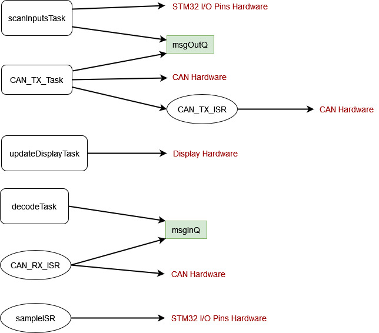

# returnSuccess4 - Analysis Report

This is the analysis report for the Music Synthesizer Coursework (CW2) of the EEE Embedded Systems module (Spring 2022).

 

## Table of content

* [Real Time Critical Analysis](./README.md#real-time-critical-analysis)
* [Shared Ressources](./README.md#shared-ressources)
* [Advanced Features](./README.md#advanced-features)

 

## Real Time Critical Analysis

abc

 

## Shared Ressources

### Description of shared ressources

The shared ressources of our program are protected to guarantee safe access and synchronisation using:
 * 2 Mutexes
 * 2 Queues
 * 1 Semaphore
 * Multiple atomic operations

And those shared ressources are the following:

1. The `keyArray`, which represents the state of all the input pins to the STM32. It is protected by the `keyArrayMutex` mutex that is used to write to it, or read to it in short bursts in order to minimize its locking time.

1. The `keyArray_prev`, which stores the last state of the keyboard keys being pressed, is also protected by the same `keyArrayMutex` mutex.

1. The `currentStepSize`, which stores the current step size of the note being played, is only written to using atomic store operations as it is accessed by the `sampleISR` interrupt and can therefore not be protected by a Mutex.

1. Similarly, the `notes_playing` boolean array stores whether or not a certain note is being played (it is used for one of our advanced features: polyphony) and has its elements modified only using atomic operations. This also because it is accessed inside the `sampleISR` interrupt, and as the whole array does not need to be synchronized and updated at once, atomic operations are used instead of a possible critical section.

1. The `msgInQ` queue, which acts as a buffer for incoming messages from the CAN Bus.

1. The last received message, `RX_Message`, which is protected by the `RX_MessageMutex` mutex as it is accessed in multiple threads (mainly the decodeTask and the updateDisplayTask (for debugging)). When used in the decodeTask thread, it is only accessed briefly to store its content into a local variable that is then used for analysis its content, still to minimize locking time.

1. The `msgOutQ` queue, which acts as a buffer for outgoing messages to the CAN Bus.

1. The `CAN_TX_Semaphore` counting semaphore, used to regulate the number of messages being sent out to the CAN Bus. Its use will be explained further in the next section.

1. Several board state variables, namely `isMuted` `isReceiverBoard` `lastMiddleCANRX` and `boardIndex` which are written to using atomic stores. This is once again because they can be accessed in an interrupt, such as `isMuted` in the `sampleISR` interrupt.

1. Multiple objects of custom classes `CAN_Knob`, `Button` and `Detect` whose member variables are all written to using atomic operations, as they can be accessed in interrupts, such as `knob3.getRotation()` in the `sampleISR` interrupt.

### Dependencies

All dependencies between the tasks of our program can be visualized in a dependency graph:

Where all red dependencies are external dependencies, interrupts are represented by an ellipsis, threads are represented by a rounded rectangle, and queues have been explicitely represented as green rectangles for a more detailed representation.

We note that mutexes are ignored in this dependency graph as they contain non-blocking operations, and always unlock the ressource after a short period of time. Atomic operations are also ignored, as they do not cause problems with dependencies.

As shown in the graph, the RX and TX queues, respectively `msgInQ` and `msgOutQ` are dependencies for all tasks accessing them. This is they are blocking whenever a task wants to read from them but they are empty (such as for the `decodeTask`), as well as when a task wants to write to them but they are full (such as for `CAN_TX_Task`).

The dependency between `CAN_TX_Task` and `CAN_TX_ISR` is because of the Counting Semaphore `CAN_TX_Semaphore` that regulates the flow of outgoing messages to the CAN Bus. This is because the STM32 can only load three messages at a time to be sent out to the bus. This semaphore therefore blocks the `CAN_TX_Task` thread until an output slot is free.

As this graph is acyclic (i.e. there are no cycles/loops), this means that there are no risks of deadlocks in our program.

 

## Advanced Features

abc
